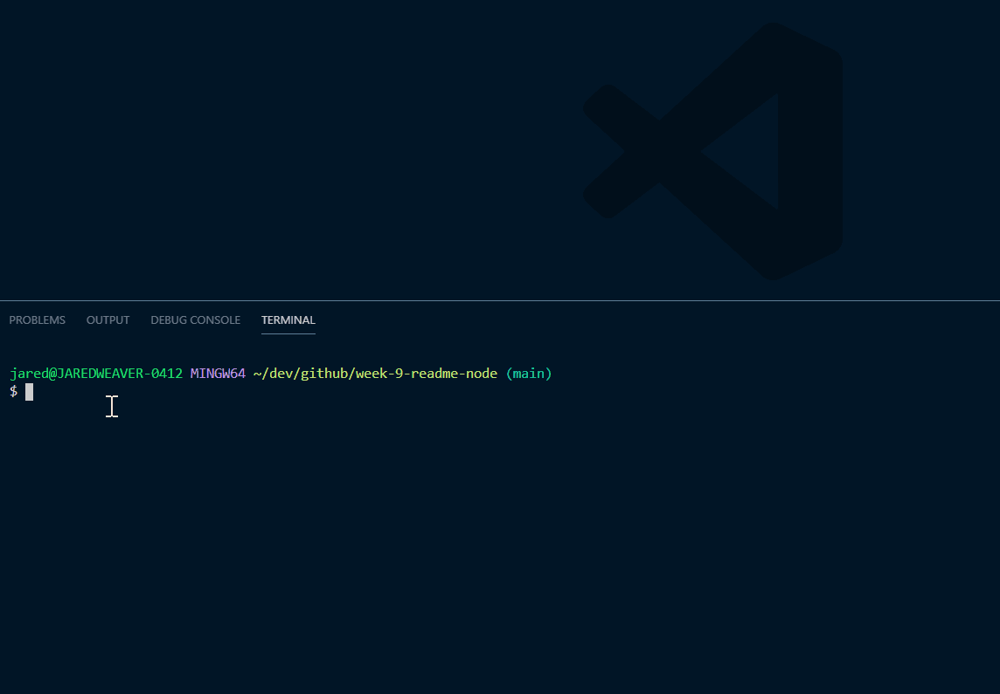

# ReadMe Generator

Generates quality README.md files through the inquirer package on npm. 


## Demo 

[Link to Demo](https://youtu.be/8Ps_p_UY-fU)



Generates quality readme's.

[](https://opensource.org/licenses/Apache-2.0)


## User Story

```md
AS A developer
I WANT a README generator
SO THAT I can quickly create a professional README for a new project
```

## Acceptance Criteria

```md
GIVEN a command-line application that accepts user input
WHEN I am prompted for information about my application repository
THEN a high-quality, professional README.md is generated with the title of my project and sections entitled Description, Table of Contents, Installation, Usage, License, Contributing, Tests, and Questions
WHEN I enter my project title
THEN this is displayed as the title of the README
WHEN I enter a description, installation instructions, usage information, contribution guidelines, and test instructions
THEN this information is added to the sections of the README entitled Description, Installation, Usage, Contributing, and Tests
WHEN I choose a license for my application from a list of options
THEN a badge for that license is added near the top of the README and a notice is added to the section of the README entitled License that explains which license the application is covered under
WHEN I enter my GitHub username
THEN this is added to the section of the README entitled Questions, with a link to my GitHub profile
WHEN I enter my email address
THEN this is added to the section of the README entitled Questions, with instructions on how to reach me with additional questions
WHEN I click on the links in the Table of Contents
THEN I am taken to the corresponding section of the README
```

## Table of Contents

* [Installation](#installation)
* [Usage](#Usage)
* [Contributions](#Contributions)
* [Tests](#Tests)
* [License](#License)
* [Questions](#Questions)

## Installation

To install the proper dependencies, please use the following command:

```
npm i inquirer
```

## Usage

Please acquire the inquirer package via npm.

## Contributions

Refer to license.

## Tests

```
node index.js
```

## License

This application is protected by the [Apache 2.0](https://opensource.org/licenses/Apache-2.0) license. 

## Questions

For any questions relating to this application, please reach out to me at the following:

Email: jared.weaver2@gmail.com

Github: [JaredWeaver](github.com/JaredWeaver)

